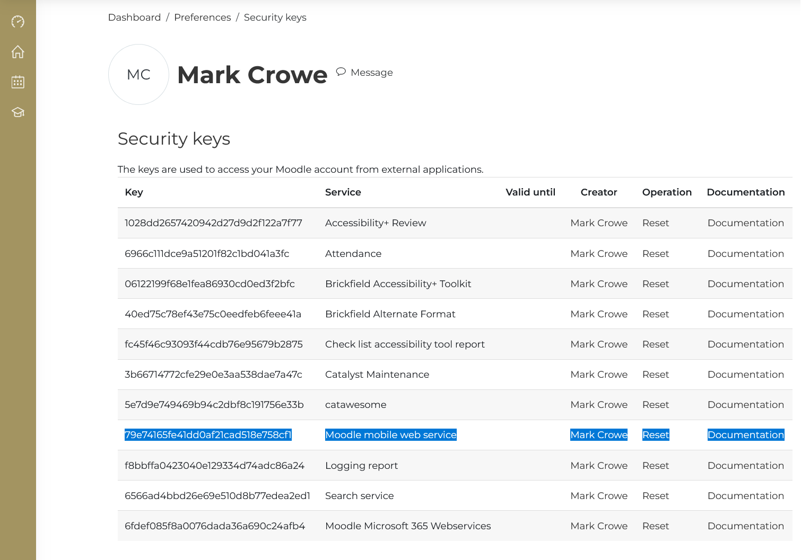
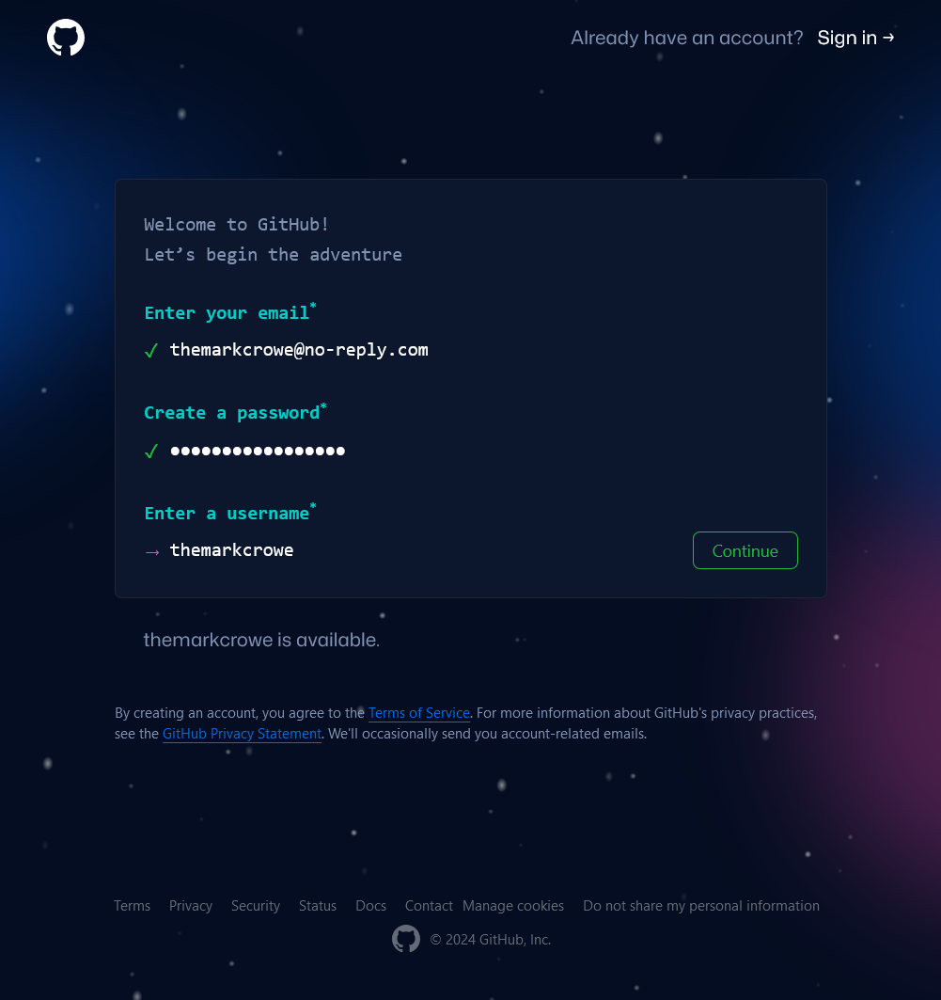

# [Student Start Instructions](https://github.com/marcocrowe/student-start-instructions "Student Start Instructions")

A quick set of instructions to get you started working with me.

## Share Moodle Notes

1. Log in to Moodle.
2. Open ManageTokens at <https://moodle.midwest.tus.ie/user/managetoken.php> [^1].
3. Press the Reset link on the `Moodle mobile web service` token in case it is expired.
4. Copy the `Moodle mobile web service` token.
5. Send me the token.

[^1]: If you are on Mobile Device, you will have to scroll right to see the Token Service and Operation columns.

> *Moodle Security Keys Screenshot*: The token of interest here is `79e74165fe41dd0af21cad518e758cf1`

## GitHub

GitHub is a platform for hosting and collaborating on software projects. It uses Git for version control, allowing you to track changes, collaborate with others, and manage your projects efficiently.

### Creating a GitHub Account

1. Visit [GitHub](https://github.com/ "GitHub") at <https://github.com/signup>.
2. Enter your email address, create a password, and choose a username.
   * Your **username** should be all **lowercase**. Ideally, your username is firstnamelastname or a variation thereof.
   * Not not use a dash **-** or underscore **_** in your username.
   * If your desired username is taken, e.g. `markcrowe` try a variation like:
     * `realmarkcrowe`
     * `themarkcrowe`
     * `notmarkcrowe`
     * `markjcrowe` *(it doesn't matter that my middle initial is not J)*
3. Follow the prompts to create a new account.

### GitHub Student Developer Pack

The GitHub Student Developer Pack is a collection of tools and services that are free for students. It includes free access to GitHub Pro and Co-Pilot, as well as discounts on software and services.

To apply for the GitHub Student Developer Pack You must:

1. Have a GitHub account.
2. Register your student email address on GitHub.
   * Go to <https://github.com/settings/emails>  Be sure to scroll down to the `Keep my email addresses private` section and check the box.
3. Have Two-Factor Authentication (2FA) enabled on your GitHub account.
   * Go to <https://github.com/settings/security> and scroll down to `Two-factor authentication` and click `Enable two-factor authentication`. Follow the prompts to set up 2FA.
4. Have your Student ID or other proof of enrollment ready.

To apply for the GitHub Student Developer Pack:

1. Sign in to your GitHub account.
2. Visit [GitHub Education](https://education.github.com/) at <https://education.github.com/>. Click `Join GitHub Education`. Then for `Select your role in education` select `Student`.  Scroll down the page to `Application` and your School and Email address should be listed. If not, add them.

Click `Continue`, then on the next page upload your proof of enrollment such as photo of your student ID, a letter from your school, or a transcript. Click `Submit`. You will receive an email from GitHub when your application is approved.

### My Moodle on GitHub

To keep track of your work, [my-moodle-template](https://github.com/marcocrowe/my-moodle-template "my-moodle-template") can download a copy of your Moodle course content to GitHub. This allows you to keep your notes and share them with your tutor.

To Start:

1. Sign in to your GitHub account.
2. Go to <https://github.com/marcocrowe/my-moodle-template> and choose `Use this template`.
3. For `Repository name`, enter `tus-firstname-lastname-moodle` all **lowercase**, where `tus` is the college, replacing `firstname` and `lastname` with your first and last name.
4. Once the repository is created, click the `Settings` tab, then `Collaborators` and click `Add People`. Enter `marcocrowe` and click `Add marcocrowe to this repository`.
5. Once I get the email notification, I will add your Moodle notes to the repository.

---
Copyright &copy; 2024 Mark Crowe <https://github.com/marcocrowe>. All rights reserved.
